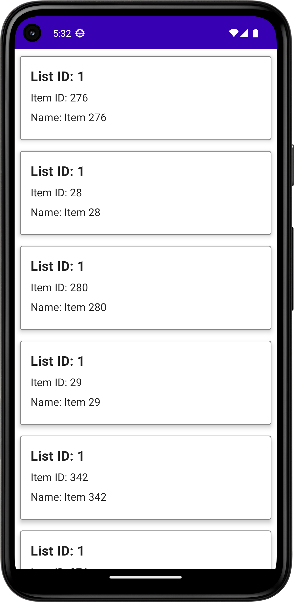
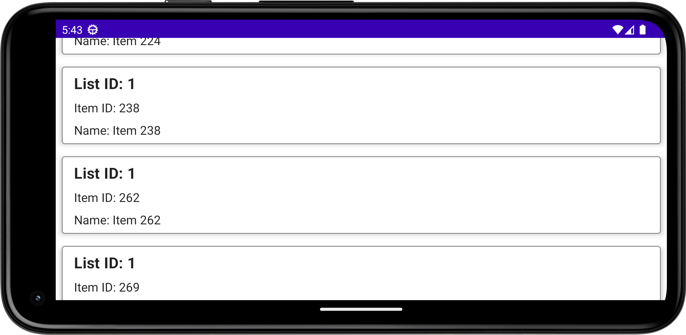

# Fetch Android Apprentice Take Home

A CLEAN MVVM approach to the takehome test including Compose, RoomDB, and Dagger Hilt

## Table of Contents

- [Installation](#installation)
- [Possible Improvements](#possible-improvements)
- [Screen Shots](#screen-shots)


## Installation

1. Clone the repository:
   ```shell
   git clone https://github.com/Bryrodr/Fetch-Android.git

## Possible Improvements
For the sake of this being a take home test, I did not include these features. In the case of a paid production project, the following would have been done:

- View Model tests
- CI/CD
- Multi Modular Approach
- Splash Screen
- Animations

## Screen Shots



